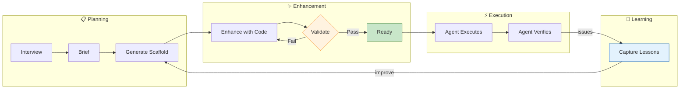

# DevPlan MCP Server

[](https://opensource.org/licenses/MIT)
[](https://modelcontextprotocol.io)
[](https://workers.cloudflare.com/)
[](#tools)

**Transform ideas into executable development plans** — an MCP server that brings the [ClaudeCode-DevPlanBuilder](https://github.com/mmorris35/ClaudeCode-DevPlanBuilder) methodology to Claude Code.

> **The Problem**: AI coding assistants often lose context, skip steps, or produce inconsistent code across sessions.
>
> **The Solution**: DevPlan creates detailed, agent-executable development plans with built-in validation, lessons learned, and inline git workflows.

## Key Features

| Feature | Description |
|---------|-------------|
| **Agent-Executable Plans** | Plans so detailed that any LLM coding agent can execute them mechanically |
| **Built-in Validation** | Validates plans are complete before execution begins |
| **Real-Time Progress Tracking** | Integrates with Claude Code's Task tools for live visibility |
| **Lessons Learned** | Captures issues from verification and injects them into future plans |
| **Issue Remediation** | Converts GitHub issues directly into remediation tasks |
| **Executor & Verifier Agents** | Auto-generates specialized agents with task tracking built-in |

## Install

```bash
claude mcp add devplan --transport sse https://mcp.devplanmcp.store/sse --scope user
```

Or add to `~/.claude.json` under the `mcpServers` key:

```json
{
  "mcpServers": {
    "devplan": {
      "type": "sse",
      "url": "https://mcp.devplanmcp.store/sse"
    }
  }
}
```

### Update Existing Installation

If you already have DevPlan installed, remove from both scopes and re-add:

```bash
claude mcp remove devplan --scope project; claude mcp remove devplan --scope user; claude mcp add devplan --transport sse https://mcp.devplanmcp.store/sse --scope user
```

## Quick Start

```
You: "Use devplan_start to help me build a CLI tool for managing dotfiles"
```

That's it. DevPlan will guide Claude through the entire process.

## The DevPlan Workflow

DevPlan uses a **scaffold → enhance → validate** workflow that ensures every plan is agent-executable before implementation begins.


```mermaid
flowchart LR
    subgraph Planning["📋 Planning"]
        A[Interview] --> B[Brief]
        B --> C[Generate Scaffold]
    end

    subgraph Enhancement["✨ Enhancement"]
        C --> D[Enhance with Code]
        D --> E{Validate}
        E -->|Fail| D
        E -->|Pass| F[Ready]
    end

    subgraph Execution["⚡ Execution"]
        F --> G[Agent Executes]
        G --> H[Agent Verifies]
    end

    subgraph Learning["🧠 Learning"]
        H -->|issues| I[Capture Lessons]
        I -->|improve| C
    end

    style E fill:#fff3e0,stroke:#f57c00
    style F fill:#c8e6c9,stroke:#2e7d32
    style I fill:#e3f2fd,stroke:#1565c0
```

### How It Works

1. **Interview** → DevPlan asks questions to understand your project
2. **Brief** → Creates a structured PROJECT_BRIEF.md with requirements
3. **Generate Scaffold** → `devplan_generate_plan` creates foundation phases + a feature list
4. **Enhance with Code** → Your AI agent structures feature phases and fills in complete, copy-pasteable code
5. **Validate** → `devplan_validate_plan` checks the plan is agent-executable
6. **Execute** → Executor agent implements each subtask with inline git commands
7. **Verify** → Verifier agent tries to break the implementation
8. **Learn** → Issues become lessons for future projects

### Validation Ensures Quality

The validation step checks that plans are truly executable:

- ✅ Complete code blocks (not pseudocode or placeholders)
- ✅ All imports included in code blocks
- ✅ No "add to existing" instructions
- ✅ No cross-subtask references
- ✅ Verification commands with expected outputs

```
# Example validation output
{
  "valid": true,
  "errors": [],
  "warnings": [],
  "stats": {
    "subtasks": 5,
    "codeBlocksChecked": 8,
    "issuesFound": 0
  }
}
```

### Real-Time Progress with Task Tools

Generated executor and verifier agents integrate with Claude Code's Task tools for live progress visibility:

- **Executor agents** create tasks for each subtask, showing real-time spinners as work progresses
- **Verifier agents** create tasks for each verification phase (Smoke Tests, Feature Verification, Edge Cases, etc.)
- Progress is visible without scrolling — you always know what Claude is working on

```
# Example: Executor tracks subtasks
TaskCreate({ subject: "1.2.3: Implement auth middleware", activeForm: "Implementing auth middleware" })
TaskUpdate({ taskId: "...", status: "in_progress" })
# ... work happens ...
TaskUpdate({ taskId: "...", status: "completed" })
```

Both Task tools (real-time visibility) and DEVELOPMENT_PLAN.md (durable record) are updated — giving you the best of both worlds.

## Usage Examples

### New Project
```
"Use devplan_start to help me build [your idea]"
```

### Fix a GitHub Issue
```bash
# Get issue JSON
gh issue view 123 --json number,title,body,labels,comments,url > issue.json

# Then tell Claude:
"Use devplan_issue_to_task with this issue to create a remediation plan"
```

### Check Progress
```
"Use devplan_progress_summary to show me where we are"
```

## Multi-Model Support

DevPlan generates plans and agent files for multiple AI coding tools and models. Use the `target` parameter to generate outputs for your preferred tool.

### Supported Targets

| Target | Tool | Agent File | Best For |
|--------|------|-----------|----------|
| `claude` | Claude Code | `CLAUDE.md` | Claude Code IDE (default) |
| `cursor` | Cursor IDE | `.cursorrules` | Cursor AI editor |
| `aider` | Aider CLI | `.aider.conf.yml` | Terminal-based AI pair programming |
| `cline` | VS Code Cline | `.cline/instructions.md` | VS Code extension |
| `windsurf` | Windsurf IDE | `.windsurf/rules.md` | Codium's AI IDE |
| `generic` | Any Model | `AGENTS.md` + files | Model-agnostic markdown format |

### Using Targets

When generating plans or agent files, specify the target tool:

**Generate plan for Cursor:**
```
"Use devplan_generate_plan to create a plan, then I'll customize it for Cursor. Set target to 'cursor' for .cursorrules format"
```

**Generate executor for Aider:**
```
"Use devplan_generate_executor with target='aider' to create an Aider-compatible executor agent"
```

**Generate generic agent files:**
```
"Use devplan_generate_claude_md with target='generic' to create model-agnostic AGENTS.md files"
```

### How Targets Work

Each target has a dedicated **adapter** that transforms the DevPlan methodology into the appropriate format:

- **Claude** - Generates `CLAUDE.md` with executor/verifier agents in `.claude/agents/`
- **Cursor** - Generates `.cursorrules` with all guidance in one file (Cursor doesn't support separate agents)
- **Aider** - Generates `.aider.conf.yml` with architect mode instructions
- **Cline** - Generates `.cline/instructions.md` with executor/verifier split
- **Windsurf** - Generates `.windsurf/rules.md` with cascade-optimized format
- **Generic** - Generates `AGENTS.md`, `EXECUTOR.md`, and `VERIFIER.md` for any tool

### Examples

**Start a new project for Cursor:**
```
"Use devplan_start to help me build a CLI tool, then generate the plan with target='cursor' for Cursor IDE"
```

**Add executor for specific target:**
```
"I have a development plan. Use devplan_generate_executor with target='aider' to create the executor agent for Aider"
```

**Compare adapter capabilities:**
See [docs/ADAPTERS.md](/docs/ADAPTERS.md) for a detailed comparison of each target's capabilities and limitations.

## Tools

### Planning

| Tool | Purpose |
|------|---------|
| `devplan_start` | Main entry point - guides Claude through the methodology |
| `devplan_interview_questions` | Get questions to gather project requirements |
| `devplan_create_brief` | Generate PROJECT_BRIEF.md |
| `devplan_parse_brief` | Parse existing brief into structured data |
| `devplan_list_templates` | List project templates (cli, web_app, api, library) |

### Generation

| Tool | Purpose |
|------|---------|
| `devplan_generate_plan` | Generate DEVELOPMENT_PLAN.md scaffold with validation instructions |
| `devplan_generate_claude_md` | Generate CLAUDE.md scaffold |
| `devplan_generate_executor` | Generate executor agent with Task tool integration |
| `devplan_generate_verifier` | Generate verifier agent with Task tool integration |

### Validation & Execution

| Tool | Purpose |
|------|---------|
| `devplan_validate_plan` | Validate plan structure and agent-executability |
| `devplan_get_subtask` | Get specific subtask details by ID |
| `devplan_update_progress` | Mark subtasks complete with notes |
| `devplan_progress_summary` | Get completion stats and next actions |

### Lessons Learned

Feedback loop that captures issues from verification and incorporates them into future plans.

| Tool | Purpose |
|------|---------|
| `devplan_add_lesson` | Capture a lesson from verifier findings |
| `devplan_list_lessons` | List accumulated lessons by severity |
| `devplan_archive_lesson` | Archive old lessons without deleting them |
| `devplan_delete_lesson` | Remove outdated or incorrect lessons |
| `devplan_extract_lessons_from_report` | Auto-extract lessons from verification reports |

### Issue Remediation

Convert GitHub issues into structured remediation tasks — perfect for bug fixes and post-release maintenance.

| Tool | Purpose |
|------|---------|
| `devplan_parse_issue` | Analyze a GitHub issue to extract requirements |
| `devplan_issue_to_task` | Generate remediation task with subtasks from an issue |

### Analytics

| Tool | Purpose |
|------|---------|
| `devplan_usage_stats` | View usage distribution across users |

## Why DevPlan?

| Without DevPlan | With DevPlan |
|-----------------|--------------|
| Context lost between sessions | Plans preserve full context |
| Inconsistent code quality | Executor agents follow exact specifications |
| Same mistakes repeated | Lessons learned system prevents recurrence |
| No verification step | Verifier agents actively try to break the code |
| Bugs found in production | Issues caught before release |
| Plans need interpretation | Validated plans are copy-paste ready |

## Dashboard & Analytics

DevPlan includes a public dashboard for viewing aggregate usage statistics:

**Dashboard URL**: [devplanmcp.store/dashboard](https://devplanmcp.store/dashboard)

The dashboard shows:
- **Summary cards**: Total sessions, total tool calls, countries reached
- **Line chart**: Sessions and tool calls over the last 30 days
- **Country table**: Top 10 countries by session count

### Privacy

All analytics are privacy-preserving:
- **No IP storage**: Only Cloudflare-derived country/region codes
- **No user identification**: Sessions are anonymous
- **Auto-expiration**: Daily stats expire after 90 days via KV TTL

## Development

```bash
npm install
npm run dev      # Local development
npm run deploy   # Deploy to Cloudflare Workers
```

## Contributing

Contributions welcome! Please see the [ClaudeCode-DevPlanBuilder](https://github.com/mmorris35/ClaudeCode-DevPlanBuilder) repo for methodology details.

## License

MIT

---

<p align="center">
  <b>Built for Claude Code</b><br>
  <a href="https://modelcontextprotocol.io">Model Context Protocol</a> •
  <a href="https://workers.cloudflare.com/">Cloudflare Workers</a> •
  <a href="https://github.com/mmorris35/ClaudeCode-DevPlanBuilder">DevPlanBuilder Methodology</a>
</p>
