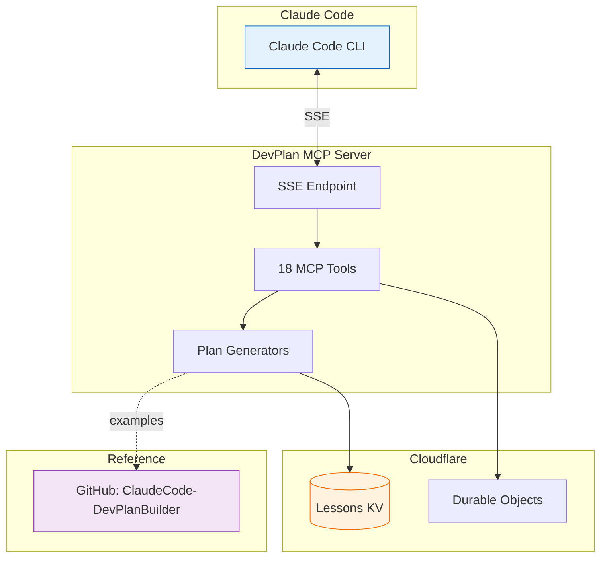

# DevPlan MCP Server

[](https://opensource.org/licenses/MIT)
[](https://modelcontextprotocol.io)
[](https://workers.cloudflare.com/)
[](#tools)

**Transform ideas into executable development plans** — an MCP server that brings the [ClaudeCode-DevPlanBuilder](https://github.com/mmorris35/ClaudeCode-DevPlanBuilder) methodology to Claude Code.

> **The Problem**: AI coding assistants often lose context, skip steps, or produce inconsistent code across sessions.
>
> **The Solution**: DevPlan creates detailed, Haiku-executable development plans with built-in verification, lessons learned, and issue remediation workflows.


## Key Features

| Feature | Description |
|---------|-------------|
| **Inline Methodology** | All guidance is embedded — no external fetches needed |
| **Haiku-Executable Plans** | Plans so detailed that Claude Haiku can execute them |
| **Lessons Learned** | Captures issues from verification and injects them into future plans |
| **Issue Remediation** | Converts GitHub issues directly into remediation tasks |
| **Tech Conflict Detection** | Warns about incompatible technology choices |
| **Executor & Verifier Agents** | Auto-generates specialized agents for your project |

## Install

```bash
claude mcp add devplan --transport sse https://devplan-mcp-server.mike-c63.workers.dev/sse
```

Or add to `~/.claude/mcp.json`:

```json
{
  "mcpServers": {
    "devplan": {
      "type": "sse",
      "url": "https://devplan-mcp-server.mike-c63.workers.dev/sse"
    }
  }
}
```

## Quick Start

```
You: "Use devplan to help me build a CLI tool for managing dotfiles"
```

That's it. DevPlan will guide Claude through the entire process:

```mermaid
sequenceDiagram
    participant You
    participant Claude as Claude Code
    participant MCP as DevPlan MCP
    participant KV as Lessons KV

    rect rgb(240, 248, 255)
        Note over You,MCP: 📋 Planning Phase
        You->>Claude: "build me a CLI tool"
        Claude->>MCP: devplan_start()
        MCP-->>Claude: inline methodology guidance
        Claude->>You: Interview questions (one at a time)
        You-->>Claude: Answers
        Claude->>MCP: devplan_create_brief()
        MCP-->>Claude: PROJECT_BRIEF.md
        Claude->>MCP: devplan_generate_plan()
        MCP->>KV: fetch lessons learned
        KV-->>MCP: past lessons
        MCP-->>Claude: DEVELOPMENT_PLAN.md + lessons
        Claude->>MCP: devplan_generate_executor()
        Claude->>MCP: devplan_generate_verifier()
    end

    rect rgb(255, 248, 240)
        Note over You,Claude: ⚡ Execution Phase
        loop Each Subtask
            Claude->>Claude: Execute with Haiku agent
            Claude->>Claude: Verify with Sonnet agent
            Claude->>MCP: devplan_update_progress()
        end
    end

    rect rgb(240, 255, 240)
        Note over You,KV: 🧠 Learning Phase
        Claude->>MCP: devplan_extract_lessons_from_report()
        Claude->>MCP: devplan_add_lesson()
        MCP->>KV: store for future projects
    end

    Claude-->>You: ✅ Project complete!
```



## Usage Examples

### New Project
```
"Use devplan to help me build [your idea]"
```

### Fix a GitHub Issue
```bash
# Get issue JSON
gh issue view 123 --json number,title,body,labels,comments,url > issue.json

# Then tell Claude:
"Use devplan_issue_to_task with this issue to create a remediation plan"
```

### Check Progress
```
"Use devplan_progress_summary to show me where we are"
```

## Tools

### Planning

| Tool | Purpose |
|------|---------|
| `devplan_start` | Main entry point - guides Claude through the methodology |
| `devplan_interview_questions` | Get questions to gather project requirements |
| `devplan_create_brief` | Generate PROJECT_BRIEF.md |
| `devplan_parse_brief` | Parse existing brief into structured data |
| `devplan_list_templates` | List project templates (cli, web_app, api, library) |

### Generation

| Tool | Purpose |
|------|---------|
| `devplan_generate_plan` | Generate DEVELOPMENT_PLAN.md scaffold |
| `devplan_generate_claude_md` | Generate CLAUDE.md scaffold |
| `devplan_generate_executor` | Generate Haiku-powered executor agent |
| `devplan_generate_verifier` | Generate Sonnet-powered verifier agent |

### Execution

| Tool | Purpose |
|------|---------|
| `devplan_validate_plan` | Check plan completeness and structure |
| `devplan_get_subtask` | Get specific subtask details by ID |
| `devplan_update_progress` | Mark subtasks complete with notes |
| `devplan_progress_summary` | Get completion stats and next actions |

### Lessons Learned

Feedback loop that captures issues from verification and incorporates them into future plans.

| Tool | Purpose |
|------|---------|
| `devplan_add_lesson` | Capture a lesson from verifier findings |
| `devplan_list_lessons` | List accumulated lessons by severity |
| `devplan_delete_lesson` | Remove outdated or incorrect lessons |
| `devplan_extract_lessons_from_report` | Auto-extract lessons from verification reports |

### Issue Remediation

Convert GitHub issues into structured remediation tasks — perfect for bug fixes and post-release maintenance.

| Tool | Purpose |
|------|---------|
| `devplan_parse_issue` | Analyze a GitHub issue to extract requirements |
| `devplan_issue_to_task` | Generate remediation task with subtasks from an issue |

```mermaid
flowchart LR
    A["gh issue view 123 --json ..."] --> B[devplan_parse_issue]
    B --> C{Analysis}
    C --> D[Type: bug/feature]
    C --> E[Severity: 🔴🟠🟡🔵]
    C --> F[Components]
    B --> G[devplan_issue_to_task]
    G --> H[DEVELOPMENT_PLAN.md]

    style A fill:#f5f5f5,stroke:#333
    style H fill:#c8e6c9,stroke:#2e7d32
```



## Architecture



## Recent Updates

```mermaid
timeline
    title DevPlan MCP Server - December 2025

    section Week 3
        Content Drift Detection : Detects outdated inline guidance
        Inline Methodology : No external fetches needed
        Issue Remediation : GitHub issues → tasks

    section Week 2
        Error Recovery : Executor agent guidance
        Lessons Enhancement : Active feedback loop
        Verifier Agent : Auto-generate verifiers

    section Week 1
        Tech Conflict Detection : Warns on bad combos
        Task Complete Sections : Squash merge workflow
```



## Why DevPlan?

```mermaid
graph LR
    subgraph Without["❌ Without DevPlan"]
        A1[Vague prompt] --> A2[Inconsistent code]
        A2 --> A3[Lost context]
        A3 --> A4[Repeated mistakes]
    end

    subgraph With["✅ With DevPlan"]
        B1[Structured interview] --> B2[Detailed plan]
        B2 --> B3[Haiku executes]
        B3 --> B4[Sonnet verifies]
        B4 --> B5[Lessons captured]
        B5 -.-> B2
    end

    style A4 fill:#ffcdd2,stroke:#c62828
    style B5 fill:#c8e6c9,stroke:#2e7d32
```



| Without DevPlan | With DevPlan |
|-----------------|--------------|
| Context lost between sessions | Plans preserve full context |
| Inconsistent code quality | Haiku follows exact specifications |
| Same mistakes repeated | Lessons learned system prevents recurrence |
| No verification step | Sonnet actively tries to break the code |
| Bugs found in production | Issues caught before release |

## Development

```bash
npm install
npm run dev      # Local development
npm run deploy   # Deploy to Cloudflare Workers
```

## Contributing

Contributions welcome! Please see the [ClaudeCode-DevPlanBuilder](https://github.com/mmorris35/ClaudeCode-DevPlanBuilder) repo for methodology details.

## License

MIT

---

<p align="center">
  <b>Built for Claude Code</b><br>
  <a href="https://modelcontextprotocol.io">Model Context Protocol</a> •
  <a href="https://workers.cloudflare.com/">Cloudflare Workers</a> •
  <a href="https://github.com/mmorris35/ClaudeCode-DevPlanBuilder">DevPlanBuilder Methodology</a>
</p>
