# DevPlan MCP Server

<div align="center">

[](https://opensource.org/licenses/MIT)
[](https://www.python.org/downloads/)
[](https://modelcontextprotocol.io)
[](https://smithery.ai/server/@mmorris35/devplan-mcp-server)

**Transform project ideas into comprehensive, paint-by-numbers development plans**

[Quick Start](#-quick-start) • [Tools](#-tools) • [Architecture](#-architecture) • [Usage](#-usage)

</div>

---

## What is DevPlan MCP?

DevPlan MCP Server exposes the [ClaudeCode-DevPlanBuilder](https://github.com/mmorris35/ClaudeCode-DevPlanBuilder) as MCP tools, enabling AI assistants to generate structured development plans with phases, tasks, and subtasks.

```mermaid
flowchart LR
    subgraph Input
        A[💡 Project Idea]
    end

    subgraph DevPlan MCP
        B[📋 Interview]
        C[📝 Brief]
        D[🗺️ Plan]
        E[📜 Rules]
    end

    subgraph Output
        F[PROJECT_BRIEF.md]
        G[DEVELOPMENT_PLAN.md]
        H[claude.md]
    end

    A --> B
    B --> C
    C --> D
    C --> E
    D --> G
    C --> F
    E --> H

    style A fill:#e1f5fe
    style F fill:#c8e6c9
    style G fill:#c8e6c9
    style H fill:#c8e6c9
```



---

## ✨ Features

| Feature | Description |
|---------|-------------|
| 🎯 **Guided Brief Creation** | Interactive questions to capture project requirements |
| 📊 **Smart Plan Generation** | Phases → Tasks → Subtasks with git workflow |
| 🔧 **Template Selection** | Auto-detect CLI, Web App, API, or Library projects |
| ✅ **Progress Tracking** | Mark subtasks complete with notes |
| 📏 **Plan Validation** | Check for completeness and best practices |

---

## 🚀 Quick Start

### Via Smithery (Recommended)

```bash
# Install from Smithery registry
npx @anthropic/mcp install @mmorris35/devplan-mcp-server
```

### Manual Installation

```bash
git clone https://github.com/mmorris35/devplan-mcp-server.git
cd devplan-mcp-server
python -m venv venv && source venv/bin/activate
pip install -e ".[dev]"
```

### Claude Code Configuration

Add to `~/.claude/mcp.json`:

```json
{
  "mcpServers": {
    "devplan": {
      "command": "devplan-mcp",
      "args": []
    }
  }
}
```

---

## 🛠️ Tools


### Brief Creation Tools

| Tool | Purpose |
|------|---------|
| `devplan_interview_questions` | Get questions to gather project requirements |
| `devplan_create_brief` | Generate PROJECT_BRIEF.md from answers |
| `devplan_parse_brief` | Parse existing brief into structured data |

### Plan Generation Tools

| Tool | Purpose |
|------|---------|
| `devplan_generate_plan` | Create DEVELOPMENT_PLAN.md with phases/tasks/subtasks |
| `devplan_generate_claude_md` | Generate project-specific AI rules |
| `devplan_list_templates` | List templates (cli, web_app, api, library) |

### Plan Management Tools

| Tool | Purpose |
|------|---------|
| `devplan_validate_plan` | Check plan completeness and best practices |
| `devplan_get_subtask` | Extract specific subtask details |
| `devplan_update_progress` | Mark subtasks complete with notes |

---

## 🏗️ Architecture


### Module Overview

```
src/devplan_mcp/
├── server.py      # FastMCP server & 9 tool definitions
├── models.py      # Pydantic models (Brief, Phase, Task, Subtask)
├── parser.py      # PROJECT_BRIEF.md parser
├── generators.py  # Plan generation pipeline
└── templates.py   # Jinja2 templates for output
```

---

## 📖 Usage Examples

### Create a Development Plan

```
User: I want to build a CLI tool that converts markdown to PDF

Claude: I'll help you create a development plan. Let me gather some information...
        [Uses devplan_interview_questions]

        What's your timeline?

User: About 2 weeks

Claude: [Uses devplan_create_brief, then devplan_generate_plan]

        I've created your development plan with 4 phases:
        - Phase 0: Foundation (setup, CLI structure)
        - Phase 1: Core Commands (markdown parsing, PDF generation)
        - Phase 2: Advanced Features (styling, config)
        - Phase 3: Polish & Release (tests, docs, PyPI)
```

### Generated Plan Structure


### Git Workflow (Task-Level Branching)


**Key principle:** One branch per task, subtasks commit to it, squash merge when complete.

---

## 🧪 Development

```bash
# Run tests
pytest tests/ -v

# Type checking
mypy src/

# Linting
ruff check src/

# Run server locally
devplan-mcp

# Run with HTTP transport
devplan-mcp --transport http --port 8000
```

---

## 📚 Tool Reference

<details>
<summary><b>devplan_interview_questions</b></summary>

Get the list of questions needed to create a project brief.

**Parameters:** None

**Returns:** JSON list of questions with IDs, text, required flag, and examples

</details>

<details>
<summary><b>devplan_create_brief</b></summary>

Create PROJECT_BRIEF.md from interview answers.

**Parameters:**
- `name` (str): Project name
- `project_type` (str): cli, web_app, api, or library
- `goal` (str): One-sentence project description
- `target_users` (list[str]): Target user types
- `features` (list[str]): Must-have MVP features
- `tech_stack` (dict, optional): Technology preferences
- `timeline` (str, optional): Project timeline
- `constraints` (list[str], optional): Constraints/requirements

**Returns:** Complete PROJECT_BRIEF.md content

</details>

<details>
<summary><b>devplan_parse_brief</b></summary>

Parse PROJECT_BRIEF.md into structured data.

**Parameters:**
- `content` (str): Full PROJECT_BRIEF.md content
- `response_format` (str): "json" or "markdown"

**Returns:** Parsed brief as JSON or markdown summary

</details>

<details>
<summary><b>devplan_generate_plan</b></summary>

Generate DEVELOPMENT_PLAN.md from project brief.

**Parameters:**
- `brief_content` (str): PROJECT_BRIEF.md or JSON brief
- `template` (str, optional): Template override

**Returns:** Complete DEVELOPMENT_PLAN.md content

</details>

<details>
<summary><b>devplan_generate_claude_md</b></summary>

Generate claude.md rules file.

**Parameters:**
- `brief_content` (str): PROJECT_BRIEF.md or JSON brief
- `language` (str): Primary language (python, typescript, etc.)
- `test_coverage` (int): Required coverage percentage

**Returns:** Complete claude.md content

</details>

<details>
<summary><b>devplan_validate_plan</b></summary>

Validate development plan for completeness.

**Parameters:**
- `content` (str): DEVELOPMENT_PLAN.md content
- `strict` (bool): Treat warnings as errors

**Returns:** Validation report with errors, warnings, suggestions

</details>

<details>
<summary><b>devplan_list_templates</b></summary>

List available project templates.

**Parameters:**
- `project_type` (str, optional): Filter by type
- `response_format` (str): "json" or "markdown"

**Returns:** List of templates with descriptions

</details>

<details>
<summary><b>devplan_get_subtask</b></summary>

Get details for a specific subtask.

**Parameters:**
- `plan_content` (str): DEVELOPMENT_PLAN.md content
- `subtask_id` (str): ID in format "X.Y.Z"

**Returns:** Subtask details as JSON

</details>

<details>
<summary><b>devplan_update_progress</b></summary>

Mark subtask as complete with notes.

**Parameters:**
- `plan_content` (str): Current plan content
- `subtask_id` (str): ID to mark complete
- `completion_notes` (str): Notes about completion

**Returns:** Updated DEVELOPMENT_PLAN.md content

</details>

---

## 📄 License

MIT License - see [LICENSE](LICENSE) file

## 👤 Author

**Mike Morris** - [Hella Dynamic](https://helladynamic.com)

---

<div align="center">

Made with ❤️ for the AI-assisted development community

[Report Bug](https://github.com/mmorris35/devplan-mcp-server/issues) • [Request Feature](https://github.com/mmorris35/devplan-mcp-server/issues)

</div>

