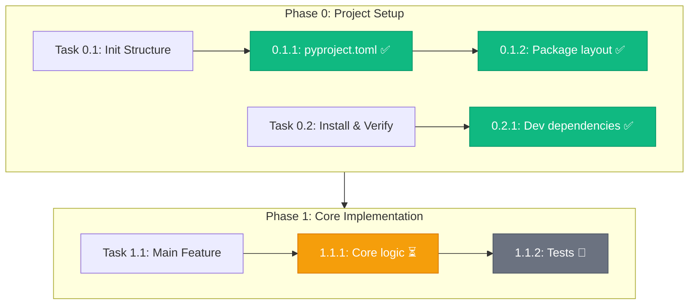

# DevPlan Workflow Exports

Formats for exporting a DEVELOPMENT_PLAN.md as visual diagrams.

---

## Progress Summary

Parse the plan to generate a completion summary. Check checkbox states
(`[x]` vs `[ ]`) across all subtask deliverables and success criteria.

### Output Format

```markdown
# Progress Summary: {Project}

## Overall: {completed}/{total} subtasks ({percentage}%)

| Phase | Name | Progress | Status |
|-------|------|----------|--------|
| 0 | Setup | 3/3 (100%) | Complete |
| 1 | Core | 2/5 (40%) | In Progress |
| 2 | Polish | 0/4 (0%) | Pending |

## Next Actionable Subtask
**Subtask 1.2.3: {Title}**
Prerequisites: All met
Branch: `feature/1-2-name`

## Recently Completed
- [x] 1.2.2: {Title} — {completion notes summary}
- [x] 1.2.1: {Title} — {completion notes summary}
```

### Parsing Logic

```bash
# Count total subtasks
total=$(grep -c '^\*\*Subtask [0-9]' DEVELOPMENT_PLAN.md)

# Count completed subtasks (all deliverable checkboxes checked)
# A subtask is complete when its Completion Notes have been filled in
completed=$(grep -c 'Implementation.*:.*[A-Za-z]' DEVELOPMENT_PLAN.md)

# Percentage
echo "Progress: $completed / $total"
```

---

## Mermaid Export

Generate a Mermaid flowchart from the plan structure. Useful for embedding
in GitHub READMEs, documentation, or viewing in VS Code.

### Format



### Generation Rules

1. Create a `subgraph` for each Phase
2. Create nodes for each Task and Subtask within the phase
3. Connect subtasks sequentially within their task
4. Connect phases sequentially
5. Apply status classes:
   - `completed` (green): All deliverable checkboxes are `[x]`
   - `inprogress` (amber): Some checkboxes are `[x]`, some `[ ]`
   - `pending` (gray): All checkboxes are `[ ]`
6. Use status icons: `completed`, `inprogress`, `pending`

### Node ID Convention

- Phases: `Phase{N}`
- Tasks: `T{phase}_{task}` (e.g., `T1_2`)
- Subtasks: `S{phase}_{task}_{sub}` (e.g., `S1_2_3`)

### Output

Write the Mermaid diagram to `workflow.md`:

```markdown
# {Project} — Development Workflow

\`\`\`mermaid
{generated diagram}
\`\`\`

Generated from DEVELOPMENT_PLAN.md on {date}.
```

---

## ReactFlow Export

Generate JSON compatible with ReactFlow for interactive visualization
in tools like Sim.ai or custom React dashboards.

### Node Schema

```json
{
  "nodes": [
    {
      "id": "phase-0",
      "type": "group",
      "data": {
        "label": "Phase 0: Project Setup",
        "status": "completed"
      },
      "position": { "x": 0, "y": 0 },
      "style": { "width": 400, "height": 300 }
    },
    {
      "id": "task-0-1",
      "type": "default",
      "data": {
        "label": "Task 0.1: Init Structure",
        "status": "completed",
        "branch": "feature/0-1-init-structure"
      },
      "position": { "x": 50, "y": 50 },
      "parentId": "phase-0"
    },
    {
      "id": "subtask-0-1-1",
      "type": "default",
      "data": {
        "label": "0.1.1: pyproject.toml",
        "status": "completed",
        "deliverables": 3,
        "deliverables_done": 3
      },
      "position": { "x": 50, "y": 120 },
      "parentId": "phase-0"
    }
  ],
  "edges": [
    {
      "id": "e-t01-s011",
      "source": "task-0-1",
      "target": "subtask-0-1-1",
      "type": "smoothstep"
    },
    {
      "id": "e-s011-s012",
      "source": "subtask-0-1-1",
      "target": "subtask-0-1-2",
      "type": "smoothstep"
    },
    {
      "id": "e-phase0-phase1",
      "source": "phase-0",
      "target": "phase-1",
      "type": "smoothstep",
      "style": { "strokeWidth": 3 }
    }
  ]
}
```

### Status Colors

| Status | Background | Border |
|--------|-----------|--------|
| completed | #10b981 | #059669 |
| in_progress | #f59e0b | #d97706 |
| pending | #e5e7eb | #d1d5db |
| blocked | #ef4444 | #dc2626 |

### Layout Algorithm

1. Phases flow top-to-bottom, spaced 400px vertically
2. Tasks within a phase flow left-to-right, spaced 250px
3. Subtasks within a task flow top-to-bottom, spaced 80px
4. Group nodes (phases) auto-size to contain children with 40px padding

---

## GitHub Issue to Remediation Plan

Convert a GitHub issue into a remediation task that follows the same plan format.

### Input

Fetch with: `gh issue view <number> --json number,title,body,labels,comments,url`

### Output Structure

```markdown
# Remediation: {issue title} (#{number})

**Source**: {issue URL}
**Priority**: {from labels or P2 default}

## Task R.1: {Fix Description}

**Branch:** `fix/{number}-{slug}`

**Subtask R.1.1: {Specific Fix}**

**Prerequisites:** None

**Deliverables:**
- [ ] {file to fix}
- [ ] {test to add}

**Complete Code:**
{complete fix code}

**Verification:**
{commands proving the fix works}

**Success Criteria:**
- [ ] Issue scenario no longer reproduces
- [ ] Regression test passes
- [ ] No existing tests broken

### Task R.1 Complete - Squash Merge

\`\`\`bash
git checkout main && git merge --squash fix/{number}-{slug}
git commit -m "fix({scope}): {description}

Closes #{number}"
\`\`\`
```

### Remediation ID Convention

Use `R.X` prefix for remediation tasks to distinguish from plan tasks.
If appending to an existing plan, find the highest existing R.X and increment.
