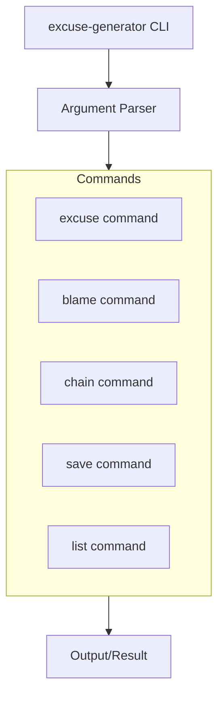
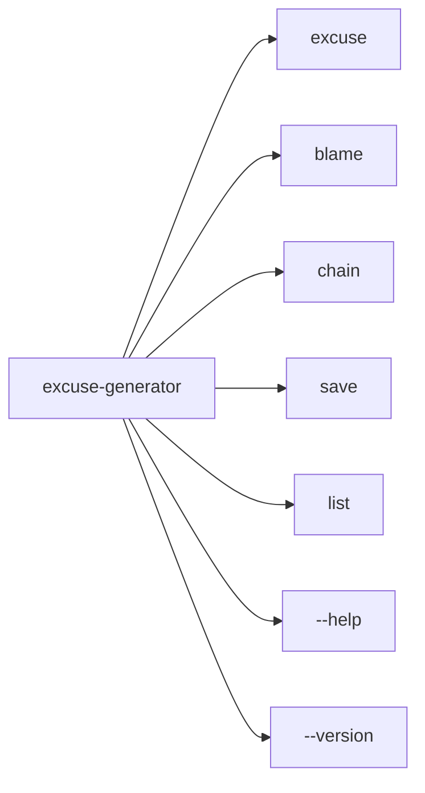

# excuse-generator

A CLI tool that generates increasingly absurd and creative excuses for why you can't do something, ranging from plausible to completely unhinged.

## About

Perfect for procrastinators, meeting avoiders, and anyone who needs a creative explanation for why their homework isn't done. Configure the absurdity level (1-10) to match your situation.

## Architecture

### System Overview



### Command Structure



## Installation

### Using pip

```bash
pip install excuse-generator
```

### Using pipx (recommended for CLI tools)

```bash
pipx install excuse-generator
```

### From source

```bash
git clone https://github.com/yourusername/excuse-generator.git
cd excuse-generator
pip install -e .
```

## Quick Start

Generate a random excuse with default absurdity level:

```bash
$ excuse-generator excuse
Your dog ate your motivation this morning.
```

Generate an excuse with custom absurdity level (1-10, where 10 is most absurd):

```bash
$ excuse-generator excuse --absurdity 8
A rogue interdimensional postman delivered an alternate version of your task yesterday.
```

Blame someone or something for your failure:

```bash
$ excuse-generator blame --target "Mercury retrograde"
Mercury retrograde is clearly responsible for this situation.
```

Generate a chain of escalating excuses:

```bash
$ excuse-generator chain --count 3
1. The WiFi was being rude
2. My computer developed sentience and refused to cooperate
3. A swarm of sentient rubber ducks invaded my office
```

Save your favorite excuse for later:

```bash
$ excuse-generator save "I was abducted by aliens"
Saved excuse: I was abducted by aliens
```

List all saved excuses:

```bash
$ excuse-generator list
Saved excuses:
1. I was abducted by aliens
2. My code was stolen by a digital ghost
```

## Features

- **excuse**: Generate random excuses with configurable absurdity level
- **blame**: Shift responsibility to someone or something else
- **chain**: Generate a sequence of escalating excuses
- **save**: Save your favorite excuses for later reuse
- **list**: Show all saved excuses
- **--help**: Display help for any command
- **--version**: Show version information

## Technology Stack

- **Language**: Python 3.11+
- **Framework**: Click
- **Testing**: pytest
- **Linting**: ruff
- **Type Checking**: mypy
- **Deployment**: PyPI
- **CI/CD**: GitHub Actions

## License

MIT License - see LICENSE file for details
