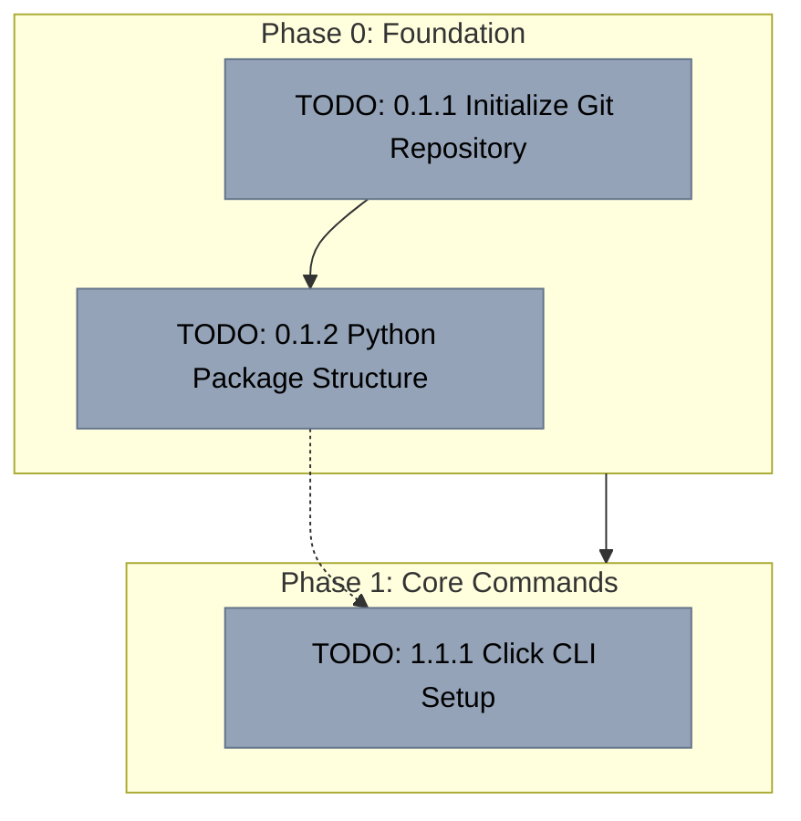

# excuse-generator - Workflow

```mermaid
flowchart TD
    subgraph P0["Phase 0: Foundation"]
        S0_1_1["TODO: 0.1.1 Initialize Git Repository"]
        S0_1_2["TODO: 0.1.2 Python Package Structure"]
        S0_1_1 --> S0_1_2
    end
    subgraph P1["Phase 1: Core Commands"]
        S1_1_1["TODO: 1.1.1 Click CLI Setup"]
    end
    P0 --> P1
    S0_1_2 -.-> S1_1_1
    classDef done fill:#22c55e,stroke:#16a34a,color:#fff
    classDef todo fill:#94a3b8,stroke:#64748b,color:#000
    class S0_1_1,S0_1_2,S1_1_1 todo
```

---
*Generated by DevPlan MCP Server*
