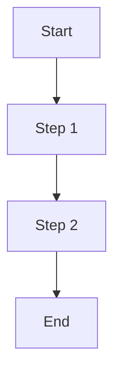
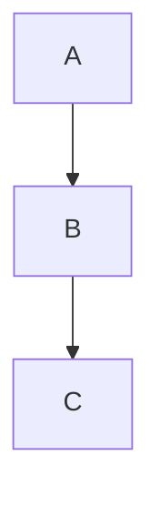

# Mermaid Test

## Test 1: graph TD

```mermaid
graph TD
    A[Start] --> B[Step 1]
    B --> C[Step 2]
    C --> D[End]
```

## Test 2: graph LR

```mermaid
graph LR
    A[Start] --> B[Step 1]
    B --> C[Step 2]
    C --> D[End]
```

## Test 3: Simple

```mermaid
graph TD
    A --> B
    B --> C
```
