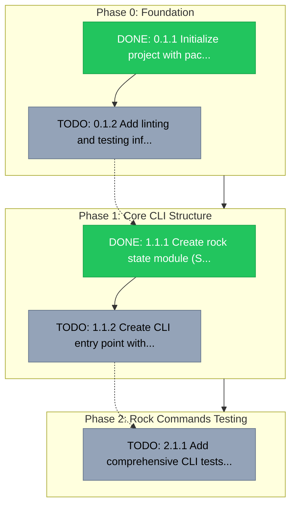

# pet-rock-cli - Workflow

```mermaid
flowchart TD
    subgraph P0["Phase 0: Foundation"]
        S0_1_1["DONE: 0.1.1 Initialize project with pac..."]
        S0_1_2["TODO: 0.1.2 Add linting and testing inf..."]
        S0_1_1 --> S0_1_2
    end
    subgraph P1["Phase 1: Core CLI Structure"]
        S1_1_1["DONE: 1.1.1 Create rock state module (S..."]
        S1_1_2["TODO: 1.1.2 Create CLI entry point with..."]
        S1_1_1 --> S1_1_2
    end
    subgraph P2["Phase 2: Rock Commands Testing"]
        S2_1_1["TODO: 2.1.1 Add comprehensive CLI tests..."]
    end
    P0 --> P1
    P1 --> P2
    S0_1_2 -.-> S1_1_1
    S1_1_2 -.-> S2_1_1
    classDef done fill:#22c55e,stroke:#16a34a,color:#fff
    classDef todo fill:#94a3b8,stroke:#64748b,color:#000
    class S0_1_1,S1_1_1 done
    class S0_1_2,S1_1_2,S2_1_1 todo
```
