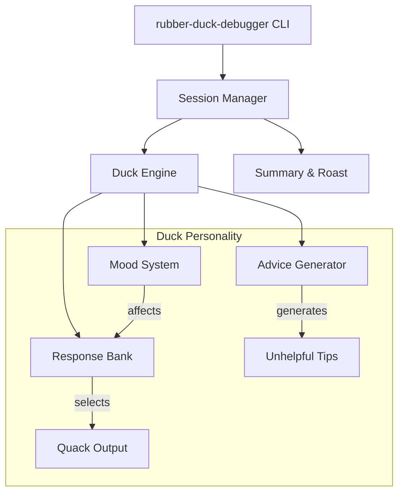

# rubber-duck-debugger

> 🦆 A CLI rubber duck debugging companion that responds with sarcastic quacks and unhelpful advice.

[](https://badge.fury.io/js/rubber-duck-debugger)
[](https://opensource.org/licenses/MIT)

## Why?

Because sometimes you need to explain your code to someone who won't judge you.
Well, actually, this duck WILL judge you. Harshly.

## Features

- 🗣️ Interactive conversation mode for rubber duck debugging
- 🦆 Sarcastic quack responses with varying levels of sass
- 💡 Genuinely unhelpful advice ("Have you tried turning it off and on again?")
- 😤 Duck mood system that gets increasingly annoyed
- 🔔 Authentic quack sound effects via terminal bell
- 📊 Session summary that roasts your debugging skills

## Installation

```bash
npm install -g rubber-duck-debugger
```

## Usage

```bash
# Start a debugging session
rubber-duck-debugger

# Or use the shorter alias
rdd
```

## Architecture



## Example Session

```
$ rubber-duck-debugger

🦆 *stares at you judgmentally*

You: My function returns undefined but I don't know why

🦆 Quack. Have you tried actually returning something?
   Mood: [😐 Mildly Interested]

You: I did return something!

🦆 QUACK. That's what they all say.
   Mood: [😑 Getting Tired of This]

You: But the console.log shows the value!

🦆 *quacks sarcastically*
   Oh WOW, console.log works. Revolutionary debugging technique.
   Mood: [😤 Deeply Unimpressed]

You: quit

🦆 === SESSION SUMMARY ===
   Duration: 3 minutes of my life I'll never get back
   Messages: 3 (all of them complaints)
   Mood trajectory: Interested → Annoyed → Done

   Debugging skill rating: 2/10
   "You asked 3 questions and solved 0 problems.
    The duck recommends: a career change to something
    that doesn't involve computers."

   *waddles away*
```

## License

MIT - Because even ducks believe in open source.
